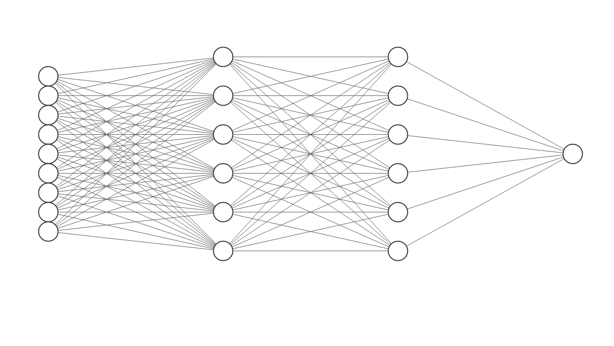

# Neural Network in NumPy

This is an in depth explanation and implementation of a simple feed-forward neural net using NumPy.

Note: This repo already assumes a basic knowledge of neural nets. Things like layers and layer sizes, weights, activation functions, batching, and so on. It's more of an in depth look at backpropagation.

## Feed-Forward

It's called a **Feed-Forward Neural Net** because we **feed the input forward** through the network starting at the input layer until the output.

Here's how we implement the feed forward algorithm.

$$
\mathbf{Z}_1 = \mathbf{X}_1 \cdot \mathbf{W}_1 \\
\mathbf{X}_2 = \text{ReLU}(\mathbf{Z}_1) \\
\mathbf{Z}_2 = \mathbf{X}_2 \cdot \mathbf{W}_2 \\
\mathbf{\hat{Y}} = \sigma(\mathbf{Z_2})
$$

Note: $\large \cdot$ represents matrix multiplication.

To start we'll get some notation out of the way:
1. $\mathbf{X}_1$ is the input.
    - It can either be a single instance i.e. \[0, 0\] (1 x 2) or a batch of instances \[[0,0],[0,1],[1,0]] (3 x 2)
1. $\mathbf{W}_1$ is the first weight matrix with a shape of (2 x 3)
1. $\mathbf{W}_2$ is the second weight matrix with a shape of (3 x 1)

- We forward our input through the first layer and get out $\mathbf{Z}_1$. 
- We then apply a ReLU activation function on $\mathbf{Z}_1$ and get $\mathbf{X}_2$. 
    - We then forward $\mathbf{X}_2$ through the second layer and get $\mathbf{Z}_2$.
- Finally we apply sigmoid ($\sigma$) on $\mathbf{Z}_2$ to get a probability, $\mathbf{\hat{Y}}$.

## Backpropagation

In backpropagation, we learn what the right set of weights are in order to give the desired output.

In this example assume our network is a general 3 layer network like below (instead of 2). This will help illustrate the pattern that arises for backpropagation. 

    

We assume we have a cost function (denoted $J$, in this case binary cross-entropy / log loss). We find the partial derivatives of the cost function with respect to each weight matrix: 

$$
\frac{\partial \mathbf{J}}{\partial \mathbf{W}_3} =  \frac{\partial \mathbf{J}}{\partial \mathbf{\hat{Y}}} \cdot \frac{\partial \mathbf{\hat{Y}}}{\partial \mathbf{Z}_3} \cdot \frac{\partial \mathbf{Z}_3}{\partial \mathbf{W}_3}
$$

$$
\frac{\partial \mathbf{J}}{\partial \mathbf{W}_2} = \frac{\partial \mathbf{J}}{\partial \mathbf{\hat{Y}}} \cdot \frac{\partial \mathbf{\hat{Y}}}{\partial \mathbf{Z}_3} \cdot \frac{\partial \mathbf{Z}_3}{\partial \mathbf{X}_3} \cdot \frac{\partial \mathbf{X}_3}{\partial \mathbf{Z}_2} \cdot \frac{\partial \mathbf{Z}_2}{\partial \mathbf{W}_2}
$$

$$
\frac{\partial \mathbf{J}}{\partial \mathbf{W}_1} = \frac{\partial \mathbf{J}}{\partial \mathbf{\hat{Y}}} \cdot \frac{\partial \mathbf{\hat{Y}}}{\partial \mathbf{Z}_3} \cdot \frac{\partial \mathbf{Z}_3}{\partial \mathbf{X}_3} \cdot \frac{\partial \mathbf{X}_3}{\partial \mathbf{Z}_2} \cdot \frac{\partial \mathbf{Z}_2}{\partial \mathbf{X}_2} \cdot \frac{\partial \mathbf{X}_2}{\partial \mathbf{Z}_1} \cdot \frac{\partial \mathbf{Z}_1}{\partial \mathbf{W}_1}
$$

---

**Let's break down the formulas:**

$\large \frac{\partial \mathbf{J}}{\partial \mathbf{W}_3}$:
 
$\frac{\partial \mathbf{J}}{\partial \mathbf{\hat{Y}}} = \frac{\partial \text{log_loss}(\hat{Y}, Y)}{\partial \mathbf{\hat{Y}}} = -\big(\frac{Y}{\hat Y} - \frac{1 - Y}{1 - \hat Y}\big) = \frac{\hat Y - Y}{\hat Y(1 - \hat Y)}$

As a reminder: $\text{log_loss}(\hat{Y}, Y) = -(Y\log{\hat Y} + (1 - Y) \log{(1 - \hat Y)})$

and if we were making batch predictions we would take the mean of the derivatives for each instance (as we'll see later on in code).

$\frac{\partial \mathbf{\hat{Y}}}{\partial \mathbf{Z}_3} = \sigma'(\mathbf{Z}_3) = [(1+e^{-\mathbf{Z}_3})^{-1}]' = \frac{e^{-\mathbf{Z}_3}}{(1+e^{-\mathbf{Z}_3})^2} = \frac{e^{-\mathbf{Z}_3}}{(1+e^{-\mathbf{Z}_3})(1+e^{-\mathbf{Z}_3})} = \frac{1}{1+e^{-\mathbf{Z}_3}} (\frac{e^{-\mathbf{Z}_3} + 1 - 1}{1+e^{-\mathbf{Z}_3}}) = \frac{1}{1+e^{-\mathbf{Z}_3}} (1 - \frac{1}{1+e^{-\mathbf{Z}_3}})= \sigma(\mathbf{Z}_3)(1 - \sigma(\mathbf{Z}_3))$

$\text{We'll set }\delta_3 = \frac{\partial \mathbf{J}}{\partial \mathbf{\hat{Y}}} \cdot \frac{\partial \mathbf{\hat{Y}}}{\partial \mathbf{Z}_3} = \frac{\hat Y - Y}{\hat Y(1 - \hat Y)} * \sigma(\mathbf{Z}_3)(1 - \sigma(\mathbf{Z}_3))$

Since $\mathbf{Z}_3 = \mathbf{X}_3 \cdot \mathbf{W}_3 \to \frac{\partial \mathbf{Z}_3}{{\partial \mathbf{W}_3}} = \mathbf{X}_3$ So in total:

$$
\frac{\partial \mathbf{J}}{\partial \mathbf{W}_3} = \frac{\partial \mathbf{J}}{\partial \mathbf{\hat{Y}}} \cdot \frac{\partial \mathbf{\hat{Y}}}{\partial \mathbf{Z}_3} \cdot \frac{\partial \mathbf{Z}_3}{\partial \mathbf{W}_3} = \delta_3 \cdot \frac{\partial \mathbf{Z}_3}{\partial \mathbf{W}_3} = {\mathbf{X}_3}^T \cdot \delta_3
$$

$\large \frac{\partial \mathbf{J}}{\partial \mathbf{W}_2}$:

$\text{Now set }\delta_2 = \delta_3 \cdot \frac{\partial \mathbf{Z}_3}{\partial \mathbf{X}_3} \cdot \frac{\partial \mathbf{X}_3}{\partial \mathbf{Z}_2}$

Since $\mathbf{Z}_3 = \mathbf{X}_3 \cdot \mathbf{W}_3 \to \frac{\partial \mathbf{Z}_3}{{\partial \mathbf{X}_3}} = \mathbf{W}_3$ and $\mathbf{X}_3 = \text{ReLU}(\mathbf{Z}_2) \text{ so } \frac{\partial \mathbf{X}_3}{\partial \mathbf{Z}_2} = \text{ReLU}'(\mathbf{Z}_2)$ therefore:

$$
\delta_2 = \delta_3 \cdot \frac{\partial \mathbf{Z}_3}{\partial \mathbf{X}_3} \cdot \frac{\partial \mathbf{X}_3}{\partial \mathbf{Z}_2} = \delta_3 \cdot {\mathbf{W}_3}^T * \text{ReLU}'(\mathbf{Z}_2)
$$
*Note: * indicates element-wise multiplication.*

Now notice:
$$
\frac{\partial \mathbf{J}}{\partial \mathbf{W}_2} = \delta_2 \cdot \frac{\partial \mathbf{Z}_2}{{\partial \mathbf{W}_2}} = {\mathbf{X}_2}^T \cdot \delta_2
$$

$\large \frac{\partial \mathbf{J}}{\partial \mathbf{W}_1}$:

$\text{Now set }\delta_1 = \delta_2 \cdot \frac{\partial \mathbf{Z}_2}{\partial \mathbf{X}_2} \cdot \frac{\partial \mathbf{X}_2}{\partial \mathbf{Z}_1} \to \delta_1 = \delta_2 \cdot {\mathbf{W}_2}^T * \text{ReLU}'(\mathbf{Z}_1)$

and notice:
$$
\frac{\partial \mathbf{J}}{\partial \mathbf{W}_1} = \delta_1 \cdot \frac{\partial \mathbf{Z}_1}{\partial \mathbf{W}_1} = {\mathbf{X}_1}^T \cdot \delta_1
$$

It's now much easier to see the pattern and we can add as many layers as we want now.